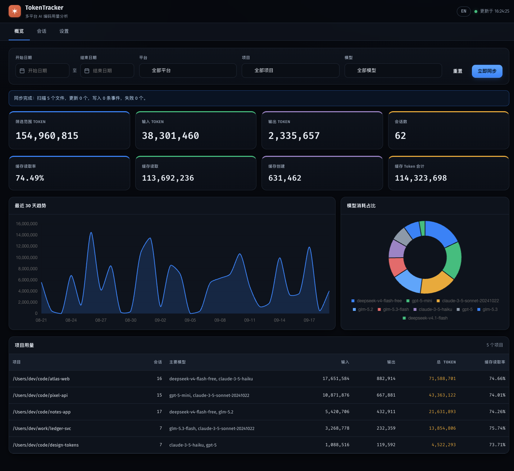
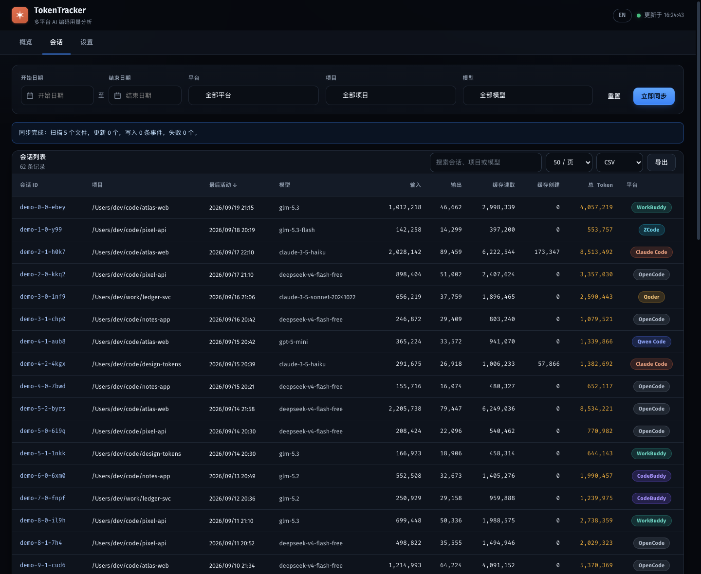
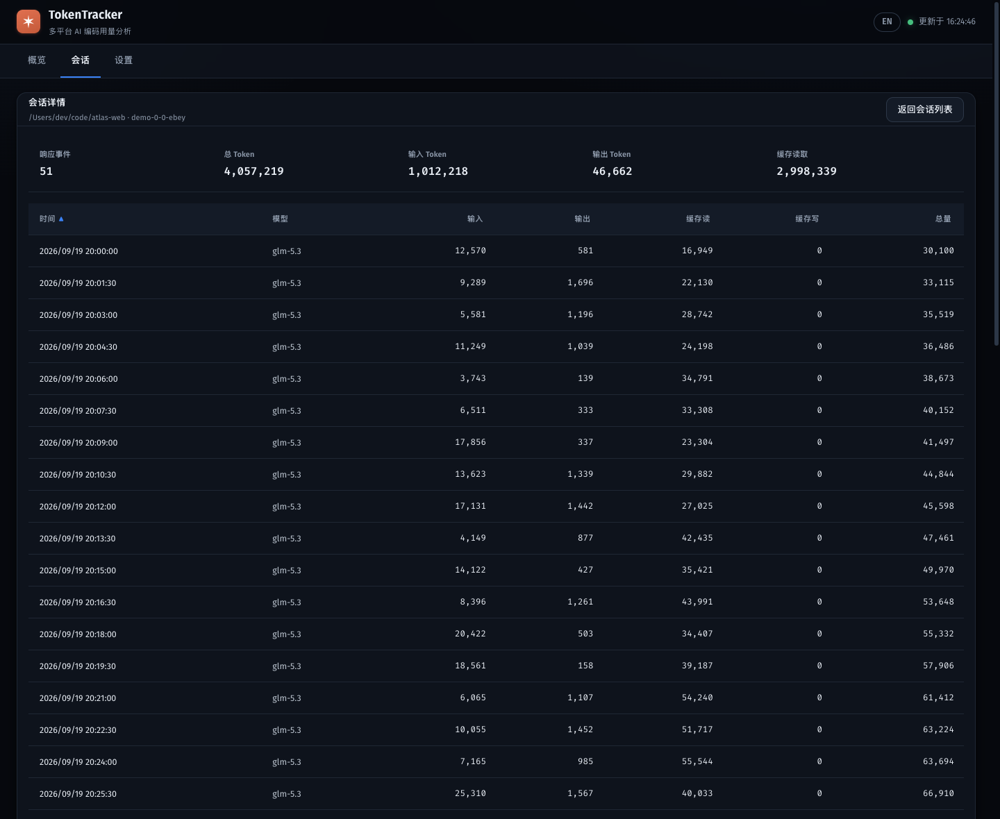
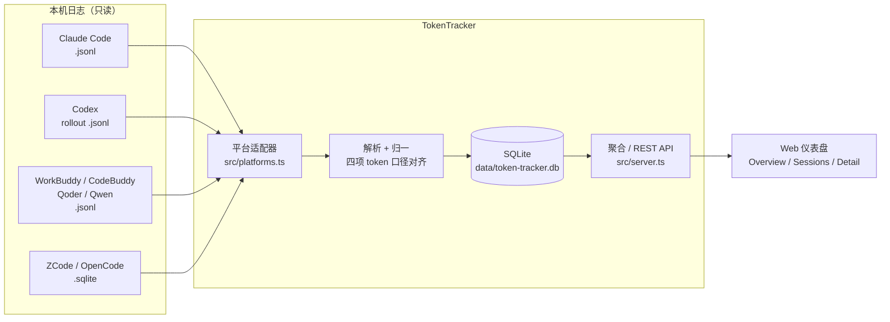

<div align="center">

# TokenTracker

**你的 AI 编码工具，到底烧了多少 Token？**

一个纯本地运行的 Token 用量仪表盘。把 Claude Code、OpenAI Codex、WorkBuddy、CodeBuddy、Qoder、Qwen Code、ZCode、OpenCode 的用量汇总进**同一个界面**。

不登录 · 不联网 · 不上传 · **只读**你的本地日志

[](./LICENSE)
[](https://nodejs.org)
[](https://www.typescriptlang.org/)
[](#支持的平台)
[](#技术栈)
[](#数据与隐私)
[](#贡献)

###### 

</div>

---

## 为什么需要它

现在的日常开发可能同时装着好几套 AI 编码工具：上午用 Claude Code 改后端，下午用 Codex 写脚本，晚上用 WorkBuddy 或 Qoder 调前端。于是问题来了 ——

- **看不到全局**：每个工具的用量各算各的，想知道「这个月一共消耗了多少 Token」，只能一家家翻。
- **看不到趋势**：想搞清楚「是哪个项目在吃 Token」「缓存到底有没有生效」，没有一个统一的地方能回答。
- **不想为了统计交出数据**：绝大多数用量面板都要求登录账号、把数据传到云端。为了看一眼 Token 数，代价太大。
- **想要的其实很简单**：Token 数、会话列表、每条会话的明细。没有别的。

TokenTracker 就是从这几条出发做的：**把本机已有的日志读出来，聚合成一个界面给你看，仅此而已。**

## 支持的平台

| 平台 | 数据位置 | 读取方式 |
| :--- | :--- | :--- |
| **Claude Code** | `~/.claude/projects/<编码目录>/*.jsonl` | JSONL 增量 |
| **OpenAI Codex CLI** | `~/.codex/sessions/<年>/<月>/<日>/rollout-*.jsonl` | JSONL 整份差分 |
| **WorkBuddy** | `~/.workbuddy/projects/<编码目录>/<会话>.jsonl` | JSONL 增量 |
| **CodeBuddy Code** | `~/.codebuddy/projects/<编码目录>/<会话>.jsonl` | JSONL 增量 |
| **Qoder CLI** | `~/.qoder/projects/*.jsonl`、`~/.qoder/logs/sessions/*/segments/*.jsonl` | JSONL 增量 |
| **Qwen Code CLI** | `~/.qwen/projects/<编码目录>/*.jsonl` | JSONL 增量 |
| **ZCode (GLM)** | `~/.zcode/cli/db/db.sqlite`（`model_usage` 表） | SQLite 只读 |
| **OpenCode** | `$XDG_DATA_HOME/opencode/opencode.db` | SQLite 只读 |

本机没装的平台会自动隐藏，**零配置**。同一个工作目录在不同平台下会归并到同一个项目，跨平台合并统计。

## 特性

- 🧩 **8 平台统一视图** —— 一个界面看完所有工具的用量，筛选条可按平台切换。
- 📊 **概览面板** —— 总 Token / 输入 / 输出 / 会话数、缓存读取率与缓存读写量、最近 30 天趋势、模型占比、项目用量榜。
- 📋 **会话列表** —— 按项目 / 模型 / 平台 / 时间筛选，支持搜索、分页、列排序、CSV / JSON 导出。
- 🔍 **会话详情** —— 逐条事件展示 Token；点击可展开该轮的 user / assistant 原文（text / thinking / tool_use / tool_result 分段渲染）。
- ⚡ **增量同步** —— 可续读的日志按字节偏移增量导入；累计差分型（Codex）与单库型（ZCode / OpenCode）每次变更整份重建。定时同步 + 手动触发。
- 🌏 **中英双语** —— 顶栏一键切换，偏好自动记忆。
- 🔒 **隐私优先** —— 见下方[数据与隐私](#数据与隐私)。

## 界面预览

| 会话列表 | 会话详情 |
| :---: | :---: |
|  |  |

> 截图使用**虚构的演示数据**生成，不是任何人的真实用量。

## 快速开始

需要 **Node.js 20.17+**（`sqlite3` 的原生模块要求）。

```bash
git clone https://github.com/zhoudev49/TokenTracker.git
cd TokenTracker
npm install
npm start
```

打开 <http://127.0.0.1:3000> 即可。首次 `npm start` 会自动编译 TypeScript 并扫描本机日志。

> `sqlite3` 是原生模块，首次 `npm install` 可能在本机编译。macOS / Linux 通常自带编译链；Windows 需要 [build tools](https://github.com/Microsoft/nodejs-guidelines/blob/master/windows-environment.md#compiling-native-addon-modules)。若编译失败，可自行换成预编译的 `better-sqlite3`。

### 常用命令

```bash
npm start          # 生产模式：先编译再启动
npm run build      # 只编译（后端 → dist/，前端 → public/*.js）
npm run dev        # 开发模式：前后端 tsc watch + nodemon 热重载
npm test           # 编译后运行全部单元测试
```

### 通过 npx 直接使用

不想 clone 仓库？发布到 npm 之后，任何人都可以用一行命令直接跑起来（首次会自动从 npm 下载）：

```bash
npx tokentracker
```

启动后访问 <http://127.0.0.1:3000> 即可。

- 数据库默认落在 `~/.token-tracker`，不与 npm 缓存混在一起，重装不丢数据。
- 支持参数：`-p/--port <端口>`、`-h/--host <地址>`、`-d/--data-dir <路径>`；也支持 `PORT` / `HOST` / `TOKEN_TRACKER_DATA_DIR` 环境变量。
- 本地自托管同样可用：`npm install -g tokentracker` 后执行 `tokentracker`。

> npx 场景同样依赖 `sqlite3` 的预编译二进制（见上方「快速开始」提示）。

## 工作原理



### 设计要点

**1. 平台适配器：加一个平台 = 加一个对象。** `src/platforms.ts` 是唯一的注册表，同步状态机与 REST 层完全不感知具体平台：

```ts
// 如果某个工具的日志也是「Claude 形态」的 JSONL，注册它就是这几行：
const windsurfAdapter = createClaudeJsonlPlatform({
  id: "windsurf",
  label: "Windsurf",
  rootDir: path.join(os.homedir(), ".windsurf", "projects"),
  envVar: "TOKEN_TRACKER_WINDSURF_PROJECTS_DIR",
});
```

**2. Token 口径对齐（最容易算错的地方）。** 各家对「input 是否已包含缓存」的约定并不一致，而且**不能用模型名判断**：

| 口径 | 平台 | 处理 |
| :--- | :--- | :--- |
| `input_tokens` **不含**缓存 | Claude Code、Qoder | 直接用 |
| `input_tokens` **含**缓存读/写 | WorkBuddy、CodeBuddy、ZCode | 需减去 `cache_read` + `cache_creation` |

判定方式是看数值关系：若 `total_tokens === input_tokens + output_tokens`，说明上报方按「含缓存」统计输入。入库后始终满足不变量：

```
input + output + cacheRead + cacheCreation === total_tokens
```

> 该规则已用真实日志逐文件对账验证。另外 OpenCode 的 `reasoning` 会并入 output，而 ZCode 的 `reasoning` 是 output 的子集，不能重复累加。

**3. 正文不落库。** 数据库只存 Token 计数、模型名、项目名、相对日志路径、会话标识。查看会话详情时才按需从原始日志实时解析正文，读完即弃。

## 数据与隐私

- **只读**：所有数据源都以只读方式访问。SQLite 库用 `OPEN_READONLY` 打开且只执行 `SELECT` —— **不会**以读写模式打开你的库，不会创建 `-wal`/`-shm`，更不会新建或修改任何第三方文件。
- **不存正文**：数据库里没有任何对话内容。
- **路径脱敏**：日志路径入库前会被处理成相对日志根目录的路径，**不含你的系统用户名与绝对目录结构**。早期版本若写入过绝对路径，启动时会自动幂等迁移。
- **不出网**：没有遥测、没有上报、没有第三方请求。数据只存在仓库内的 `data/`（已 gitignore）。
- **只监听本机**：默认绑定 `127.0.0.1`，不暴露到局域网或公网。

## 配置

| 变量 | 默认值 | 说明 |
| :--- | :--- | :--- |
| `PORT` | `3000` | 监听端口 |
| `HOST` | `127.0.0.1` | 监听地址（保持默认即可） |
| `TOKEN_TRACKER_DATA_DIR` | `./data` | 数据库目录 |

各平台数据路径可覆盖（主要用于自定义安装位置或测试）：

| 变量 | 对应平台 |
| :--- | :--- |
| `TOKEN_TRACKER_CLAUDE_PROJECTS_DIR` | Claude Code |
| `TOKEN_TRACKER_CODEX_SESSIONS_DIR` | OpenAI Codex CLI |
| `TOKEN_TRACKER_WORKBUDDY_PROJECTS_DIR` | WorkBuddy |
| `TOKEN_TRACKER_CODEBUDDY_PROJECTS_DIR` | CodeBuddy Code |
| `TOKEN_TRACKER_QODER_DIR` | Qoder CLI |
| `TOKEN_TRACKER_QWEN_PROJECTS_DIR` | Qwen Code CLI |
| `TOKEN_TRACKER_ZCODE_DB` | ZCode |
| `TOKEN_TRACKER_OPENCODE_DB` | OpenCode |

## REST API

服务同时提供一份本地 API，可自行接脚本、快捷指令或自建看板：

| 端点 | 说明 |
| :--- | :--- |
| `GET /api/platforms` | 已注册平台 + 本机可用性探测 |
| `GET /api/summary` | 总量、Token 分项、30 天趋势、模型占比 |
| `GET /api/projects` | 项目维度聚合 |
| `GET /api/cache-efficiency` | 缓存读取率与读写量 |
| `GET /api/sessions` | 会话列表（筛选 / 搜索 / 排序 / 分页） |
| `GET /api/sessions/:id` | 会话详情（事件分页） |
| `GET /api/sessions/:id/prompts` | 该会话的正文分段（按需回读） |
| `GET /api/filters` | 可选的平台 / 项目 / 模型清单 |
| `GET /api/export` | 导出 CSV 或 JSON（`format=csv`，会话数封顶 5000，超出时带 `X-Export-Truncated` 响应头） |
| `POST /api/sync` | 手动同步（`{"platform":"claude"}`，省略则全部同步） |
| `GET /api/sync/status` | 各平台同步状态与失败文件诊断 |

所有列表端点都接受 `platform` / `projectName` / `model` / `startDate` / `endDate` / `search` 查询参数。

## 扩展一个新平台

1. **日志是「Claude 形态」JSONL 的**：在 `src/platforms.ts` 加一行 `createClaudeJsonlPlatform({...})` 即可，目录结构不同就覆盖 `accept` / `projectNameFromPath` / `sessionIdFromPath`（参考 Qoder 的写法）。
2. **其他格式**：写一个解析模块并注册带自定义 `listFiles` / `parseFile` 的适配器（参考 `src/zcode-parser.ts`、`src/opencode-parser.ts`）。
3. 在 `public/styles.css` 里补一个 `.platform-<id>` 徽章配色。
4. 在 `test/platform-parsers.test.ts` 里补该格式的解析用例。

前端**不需要改动**：平台下拉与徽章都是运行时从 `/api/platforms` 生成的。

## 已知局限（诚实说明）

- **历史取决于日志文件**。工具自己会清理或滚动日志；日志没了，TokenTracker 也就没有那段历史，数据库不会凭空补出过去的数据。
- **Qoder 的部分账号把用量留在服务端**，本地日志里的 token 字段恒为 0。这类记录会被自动跳过（不污染统计），因此可能看不到 Qoder 的用量。
- **CodeBuddy / Qoder / Qwen 适配器按官方文档与同类日志格式实现**，作者本机未安装这些工具，尚未用真实日志验证。欢迎提交脱敏样本帮助完善。
- **界面不展示任何价格 / 成本信息**，这是有意为之 —— 很多模型没有公开定价，与其猜一个数字，不如不显示。后端保留了计价能力，需要时可接回。

## 技术栈

- **后端**：TypeScript + Express + SQLite（`sqlite3`）。运行时依赖只有 2 个。
- **前端**：零框架、零构建工具的原生 TypeScript（编译成 classic script IIFE），图表用本地化的 Chart.js。
- **测试**：Node 内置 `node:test`，无外部测试框架；覆盖日志解析、Token 口径、增量同步、数据库、CSV 转义、i18n 词典完整性。

<details>
<summary>项目结构</summary>

```
src/                     后端（编译到 dist/src/）
  server.ts              Express 服务、按平台扫描/同步、REST API
  platforms.ts           平台注册表 ← 新增平台改这里
  platform-adapter.ts    适配器契约与公共工具（路径、时间戳、项目名编码）
  claude-jsonl-parser.ts 「Claude 形态」JSONL 通用解析器
  log-parser.ts          Claude Code 专用解析
  codex-parser.ts        Codex rollout 解析（累计快照差分）
  sqlite-util.ts         只读打开第三方 SQLite + WAL 感知的变更签名
  zcode-parser.ts        ZCode 用量读取
  opencode-parser.ts     OpenCode 用量读取
  database.ts            SQLite 建表、读写、同步状态
  analytics.ts           聚合统计与 CSV 输出
  pricing.ts             模型参考单价（后端保留，界面不展示）
public/                  前端仪表盘（无框架、无构建步骤）
  index.html / sessions.html / session.html / settings.html
  common.ts              共享壳层：导航、筛选条、API 封装、i18n 接入
  i18n.ts                中英双语词典
  vendor/                本地化第三方库（chart.js / flatpickr / tom-select）
test/                    单元测试
docs/screenshots/        README 截图
```

</details>

## 贡献

欢迎 Issue 与 PR，尤其是：

- 提交**新平台的适配器**（附脱敏后的日志样本最好）
- 用真实日志反馈 CodeBuddy / Qoder / Qwen 的解析是否正确
- 补充测试、改进文档、修正翻译

```bash
npm test    # 提交前请确保全绿
```

## 许可

[ISC](./LICENSE) © 2026 zhoudev

<div align="center">
<sub>如果这个项目对你有用，欢迎点个 ⭐️</sub>

<sub>🌏 中国大陆用户可访问 <a href="https://gitee.com/zhoudev49/TokenTracker">Gitee 地址</a></sub>

</div>
